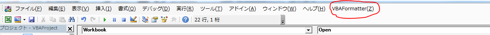

# VBAFormatter

## What's this?

It is a tool that automatically shapes the indentation of VBA code .
 it will be available as a code formatter .
This can be used as an Excel add-in .
## How to install
```bash
double click 「Install.vbs」
```
Open Excel and Check Option


When you open the VBA editor , has been added menu



## Requirement

* Windows7
* Excell2010

## LICENSE

* MIT
